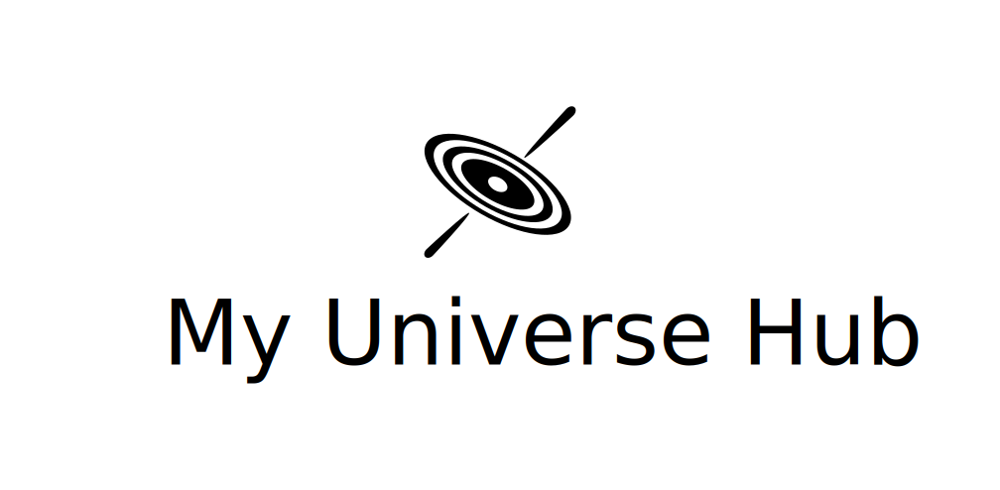

# My Universe Hub - APOD, Reimagined

[](https://github.com/ImadSaddik/My_Universe_Hub/actions/workflows/ci.yml)
[](https://myuniversehub.com/)
[](https://github.com/ImadSaddik/My_Universe_Hub/blob/main/LICENSE)
[](https://codecov.io/gh/ImadSaddik/My_Universe_Hub)



## The story

Hello astro enthusiasts and welcome to the **My Universe Hub** repository! I'm Imad Saddik, and I'm obsessed with astronomy. I stumbled into this amazing field when I was 19, and honestly, discovering the wonders of the universe has been the best thing that's ever happened to me.

### OK, but why?

After months of using APOD, I started thinking, "Hey, this site looks a bit outdated." Since I've been learning web development, I had this crazy idea: Why not give APOD a modern look—one that’s easier to navigate, more interactive, and visually engaging? That's how **My Universe Hub** was born!

This little project of mine is my baby. I've invested hundreds of hours and over a year of work into it. I am sharing it with everyone to enjoy it and to contribute to it.

### Hm, Interesting

I absolutely love looking at the stunning images shared by NASA, ESA, CSA, and even amateur or professional astronomers on the internet. One of my favorite places to go is [APOD](https://apod.nasa.gov/apod/archivepix.html) (Astronomy Picture Of the Day). What's cool about APOD is that you never know what you're gonna get each day. It's like a little surprise waiting for you every time you visit.

### Explore and enjoy

Curious about how I built it? [Check out my journey on YouTube](https://youtu.be/kvoKKJ2zsts?si=GTlOPbKAAtVH6Yyv)

## Website overview

To access the website, visit this page: [https://myuniversehub.com/](https://myuniversehub.com/)

<p align="center">
  
</p>

By default, you will land on the home page. Here, you’ll find a search box where you can search for specific images by typing keywords. Below the search section, ten images are displayed by default. To load more images, simply click the Load More button.

The **Today's Picture** tab shows the image that was uploaded to APOD on that particular day.

The **Trending page** ranks the images by likes, displaying the most popular results.

If you’ve created an account, you can view the images you’ve liked in the **Favourites page**.

The **Contribute page** explains how you can support and contribute to the project.

In the **About page**, we discuss the reasons behind building **My Universe Hub**, thanking NASA, other agencies, and astronomers for their contributions.

On the far right of the page, you'll find the star count and a quick link to the GitHub repository.

Next to that, you’ll see the Login/Logout button.

## Contributing

I adore this image, it is one of my favorites. It is the Antennae galaxies, also known as NGC 4038 and NGC 4039. They are a pair of interacting galaxies and are currently in the process of colliding and merging with each other. I am sending you this image as a token of my appreciation for your support. I hope you like it as much as I do.

<p align="center">
  
</p>
<p align="center" style="margin-bottom: 1rem;">
  Image credit: Kent E. Biggs
</p>

Remember, I ❤️ you all! To contribute, it does not matter if you know how to code or not, there are many ways you can help support My Universe Hub. Here are a few ideas:

### 1. Spread the word

Love what we're doing? Share My Universe Hub with your friends, and fellow space enthusiasts. The more people know about us, the more we can grow and improve! Dont't forget that we do have a [discord](https://discord.com/invite/nADvHzQyvZ) server you can join.

### 2. Code contributions

My Universe Hub is open-source! The code is broken into two repositories, one for development (public, it is this repository) and the other one is for production (private). We are separating the two because, we want to keep the users data safely secured in the private repository. The development repository is where we develop new features, fix bugs, and test new ideas. Once we are confident that the new feature is working as expected, we merge it into the production repository.

- For developers: If you want to help us develop new features, fix bugs, or test new ideas, feel free to fork the development repository, make your changes, and submit a pull request. We will review your changes and merge them into the production repository if they meet our standards.

- For the rest: If you have an idea for a new feature, a bug to report, or a suggestion to make, feel free to open an issue in the development repository. We will review your issue and work on it as soon as possible.

### 3. Help in hosting the website

My Universe Hub is hosted on a machine provisioned from digital ocean. If the website grows and we need to upgrade the machine, we will need more funds to keep the website running. If you want to help us in hosting the website, you have a lot of options to donate.

You can donate via the following platforms:

[Paypal](https://paypal.me/ProGamer20177?country.x=MA&locale.x=en_US) </br>
[Patreon](https://www.patreon.com/3CodeCamp)

### 4. Translation

My Universe Hub is currently available in just one language: English. If you are fluent in another language and want to help us translate the website, feel free to fork the development repository, make the necessary changes, and submit a pull request.

To translate the APOD entries, you can use [LLM](https://en.wikipedia.org/wiki/Large_language_model)s (Large Language Models) if you are familiar with them, they are incredible at translating text. If you are not familiar with them, you can use [Google Translate](https://translate.google.com/?sl=en&tl=ar&op=translate), but be sure to review the translation to make sure it is accurate.

## Installation

Follow these steps to get the project up and running:

1. **Clone this repository:**

   ```bash
   git clone https://github.com/ImadSaddik/My_Universe_Hub.git
   ```

2. **Navigate to the project directory:**

   ```bash
   cd My_Universe_Hub
   ```

3. **Create a virtual environment and activate it:**

   - Using `anaconda`:

     ```bash
     conda create -n myuniversehub python=3.11
     conda activate myuniversehub
     ```

   - Using `venv`:

     ```bash
     python -m venv .myuniversehub
     source .myuniversehub/bin/activate  # On Windows: .myuniversehub\Scripts\activate
     ```

4. **Navigate to the backend directory:**

   ```bash
   cd backend
   ```

5. **Install backend dependencies using `uv`:**

   Ensure `uv` is installed. See [uv installation guide](https://astral.sh/uv#installation).

   ```bash
   uv pip install -r requirements.txt
   ```

   Alternatively, if you don't have `uv`, you can use `pip`:

   ```bash
   pip install -r requirements.txt
   ```

6. **Set up Environment Variables:**

   Create a `.env` file in the current directory (`backend/`) with your necessary environment variables. Refer to `.env.example`.

   To set `EMAIL_HOST_USER` and `EMAIL_HOST_PASSWORD`, [watch this video](https://www.youtube.com/watch?v=SalrBanIUmc) to learn how to set up a Gmail account for sending emails.

7. **Create the SQLite database:**

   Ensure you are in the `backend` directory.

   ```bash
   python manage.py makemigrations
   python manage.py migrate
   ```

8. **Fill database:**

   Ensure you are in the `backend` directory.

   ```bash
   cd utils
   python fill_database.py
   cd ..
   ```

   `cd ..` brings you back to the `backend` directory.

9. **Start Django server:**

   Ensure you are in the `backend` directory.

   ```bash
   python manage.py runserver 0.0.0.0:8000
   ```

10. **Ensure pnpm is installed globally:**

    If you don't have pnpm, install it globally. One common way is using npm (this can be run from any directory):

    ```bash
    npm install -g pnpm
    ```

    Or refer to the official [pnpm installation guide](https://pnpm.io/installation) for other methods.

11. **Navigate to the frontend directory:**

    From the project root `My_Universe_Hub/`

    ```bash
    cd frontend
    ```

    If you were in the `backend/` directory from the previous steps, you would use `cd ../frontend`

12. **Install frontend dependencies:**

    Ensure you are in the `frontend` directory.

    ```bash
    pnpm install
    ```

13. **Start the frontend development server:**

    Ensure you are in the `frontend` directory.

    ```bash
    pnpm run dev
    ```

## Acknowledgements

Thank you NASA, ESA, CSA and all the other astronomers for sharing those beautiful images on the internet and especially on APOD. This work wouldn't have been possible without your effort. We really appreciate it.
